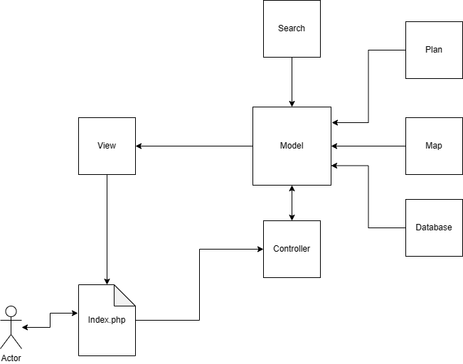

# Diagram przedstawiajacy podział kodu na pod obiekty.
## View jest odpowiedzialny za wyświetlanie wyników.
W nim zawiera się domyślny schemat strony i domyślny css.
Zawiera navbar i js, który odpowiednio do strony zmienia ustawienie przycisków. (lub do rozwiązania w php)
## Model jest odpowiedzialny za operacje na plikach, modyfikacje i odczyt z bazy danych.
Jego funkcja to most pomiędzy View a Controllerem.
Zawiera odwołania do odpowiednich funkcji, które mogą zostać wykonane przez controller.
Jest to swego rodzaju opakowanie wszystkich podstron.
## Controller jest odpowiedzialny za odbieranie akcji od użytkownika.
Kontroler mapuje akcje użytkownika z odpowiedziami aplikacji.

